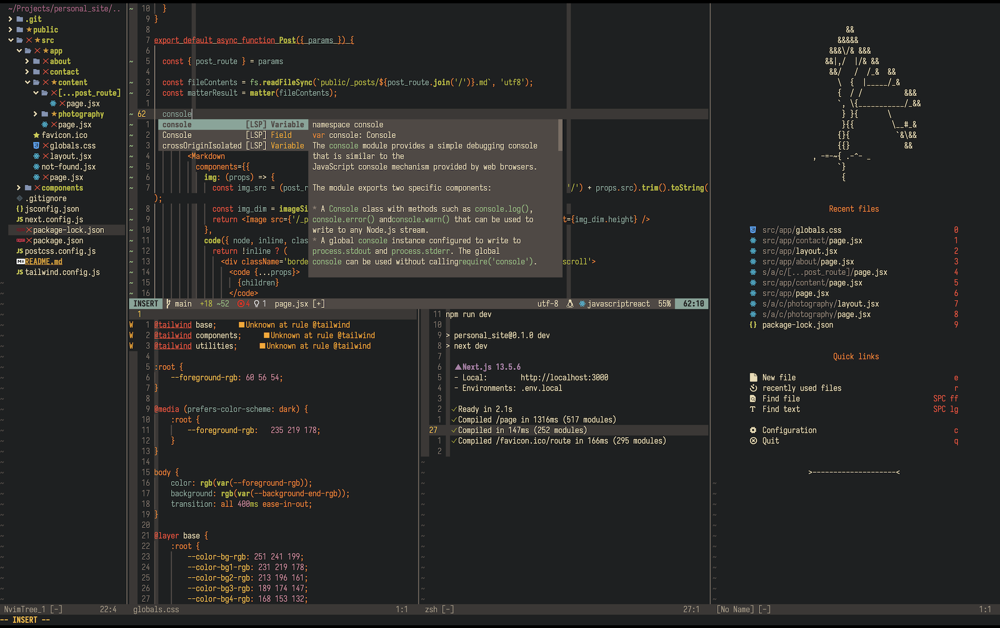
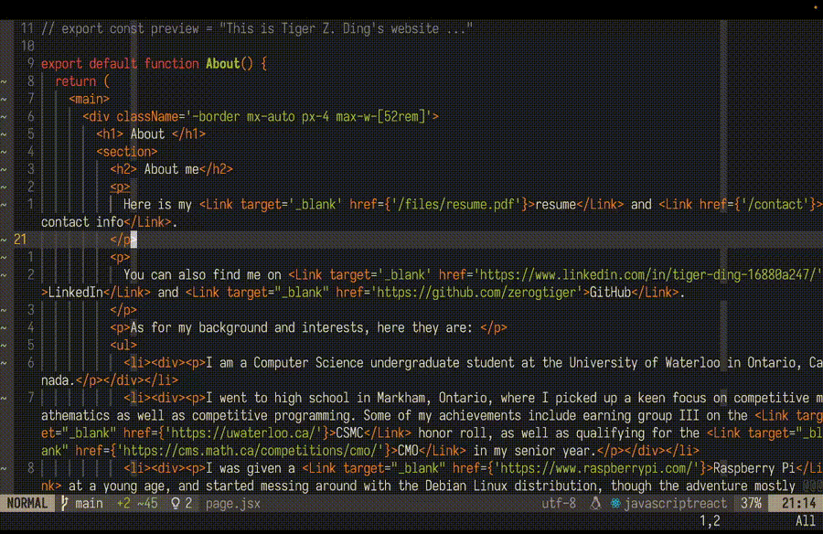

# Code as fast as thought: a beginner's guide to building a tailored editor with Neovim

This tutorial series aims to guide you in building an **efficient, tailored** editor based on Neovim to help you increase coding efficiency.

## Goal of this series

To code and navigate your code as fast as thought. Specifically, the goals of this series are
<ol>
<li>Build a fast coding editor tailored to your specific needs</li>
<li>Increase your coding efficiency by using your own editor</li>
</ol>

and these two goals should interest you if you are
- Looking to build code projects faster
- Interested to make your editor *truly* your own, beyond just colorschemes
- Wanting to impress your co-workers with your coding speeds

and additionally, if you fall into any of the following categories, you will also find the content of this series interesting
- Wanting to learn about Vim or Neovim
- Looking for a light-weight editor with no compromises on functionality
- Seeking an editor that is truly open source, not associated with any party
- Tired of VSCode

## Contents

1. [**Pre-requisites**](prereq)

    Recommended software requirements and knowledge before starting the series, with solutions or short tutorials to help you fulfill them. 

*Coming very soon*

2. **Installation**
    
    Install the bare-bones Neovim editor.

1. **(Neo)Vim Basics**

    Learn the terms and notation of (Neo)Vim, navigating the editor, modes, Vim motions, and commands. 

1. **Built-in features**

    Explore useful features of Neovim that are shipped right out of the box.

1. **The plugin system**
    
    Learn why plugins is an essential part of the editor, how to install and configure plugins, the recommended plugin list, and how to install a plugin yourself. 

1. **Running code**

    Learn to write a short Lua script to customize how code is executed.

1. **Tips and further reading**

    How to practice, further the customization to your needs, and other great sources of learning about Neovim.

## How this series work

This series consists of 7 articles, with each except the last being an important step in achieving the goal: either coding efficiency, editor tailoring, or both. 

Each article of the guide will consist of two parts
1. Theory: knowledge about what will be done and how it works
1. Hands-on: apply the theory, actually getting your hands dirty, and get closer to final goal

Occationally, parts in an article may contain one or both of the following
1. Mini tutorial to get you up to speed
1. An external source if you want to go more in depth and learn more than the necessary for this series

## Show me the results

Here are some Neovim features that I use on a daily basis:

- Quickly switching between files with Telescope.nvim:

- Quickly add, move, and delete panes:

- Undo to arbitrary points in my editing history with Undotree:

- Write math equations in LaTeX documents with autosnippets:

- Use macros to finish tedius, time-consuming tasks quickly: 

- Use the floating terminal to finish quick tasks without exiting the editor:

- Play games:

## Give me the code

You can find the daily driver setup for my MacBook (full config in the next section) in my [GitHub dotfiles](https://github.com/zerogtiger/dotfiles/tree/main/nvim/macos). If you're also on MacOS, they should work straight out of the box. 

If you're looking for a more minimalistic setup, try the one for Raspberry Pi OS, also uploaded to my [Github dotfiles](https://github.com/zerogtiger/dotfiles/tree/main/nvim/rpios). 

Consider giving the repo a star if it helps you. 

## Configuration

Here is a brief overview of the setup used in this series:
- Terminal: **Alacritty**
- Colorscheme: **Gruvbox**
- OS: **MacOS**

## Finding help

If you ever find yourself stuck in a specific part of an article, take it as a great opportunity to train your Google-fu.

Wait, this sounds so irresponsible
 

As irresponsible as it sounds, this was what I did when I learned all content in this series on my own. It will expose you to more related knowledge, making you more knowledgable in this field and will help you get better at finding answers on the internet the next time you have a question, coding related or not. 

Some tips when Googling: 
- Include all useful details about your specific setup (ex. OS, editor name (nvim), plugin name, etc.)
- Summarize the core of the problem, keep it short and include keywords only
- Consider and explore all possible causes of the problem
- Go down the rabbit hole (i.e., if you realize your problem is caused by another thing, Google that new thing)
    <!-- 1. Trace the problem -->

Alternatively, contact me and I'll try to provide assistance. 

## What it takes to finish this series

<!-- If you are only interested in certain parts of this series (ex. Neovim basics and build-in features) -->

If you are just skimming through this series quickly, it may take somewhere around 10 to 15 mins. 

However, if you are committed to finishing this series from beginning to end, it may take 2-3 weekends or two weeks worth of evenings to complete and 1-2 months of constant usage to be fully proficient and "code as fast as thought."

## Philosophy

If you are not interested in why Neovim was selected to serve as the basis of our customizations, feel free to get started right away!

**Remark:** do not worry if you find unfamilar terms in the discussion below. They will be explained in later articles of this article. 

A little about Neovim: it is a modernized **fork** of the UNIX editor Vim. It has better support for modern features like LSPs (language server protocol, don't worry if you don't know what it is), faster parsing engine, and more. 

Here are some questions I know people will ask
1. Q: Why Neovim and not Vim or Helix?

    A: Vim and its associated plugins are too old with few updates, meaning they are slow by current standards and often lack proper support. They have also made the very questionable decision to create a new scripting language from scratch in the recent 9.0 update when better alternatives (including `lua`, the language Neovim supports for configuration) are readily available. <s> Vim is also used mostly by old men. </s>

    On the other hand, Helix is too new (post-modern, as they've said themselves), lacking a well-defined way to install plugins, not to forget that so few Helix plugins have been written.

1. Q: Why not VSCode?
    
    A: Despite being a great beginner option, it has some key problems which I have experienced first hand
    - **Resource inefficient**, both computing and storage. This is especially true when you start downloading plugins for specific languages
    - **Little customization capacity**. Sure, you can change your shortcuts and color scheme. But during my use at least, I was unable to do much else
    - **Buggy**. It would randomly generate strange errors that gave literally zero information on the root cause. What follows is one of two things: either hours of Googling or constantly closing and re-opening the editor hoping it would magically go away. 
    - **Little focus on coding**. There are so many useless graphical elements that take attention away from what the software is meant to do: writing code.

<!-- - Intro -->
<!--     - Goal of this series -->
<!--     - How these articles will work (tutorials to get started, link to external source that has more in depth view) -->
<!--     - Philosophy (why not vscode / why a vim style editor / why Neovim and not Helix or Vim) -->
<!--     - How to find help when you're stuck -->
<!--         - Slowly get better at Googling -->
<!--     - What it takes to finish (time commitment) -->
<!--     - Demo (GIFs) -->
