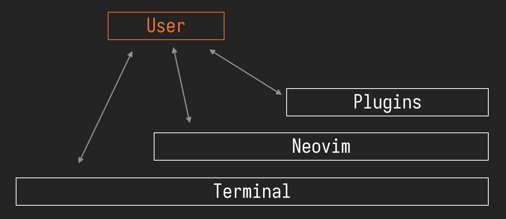
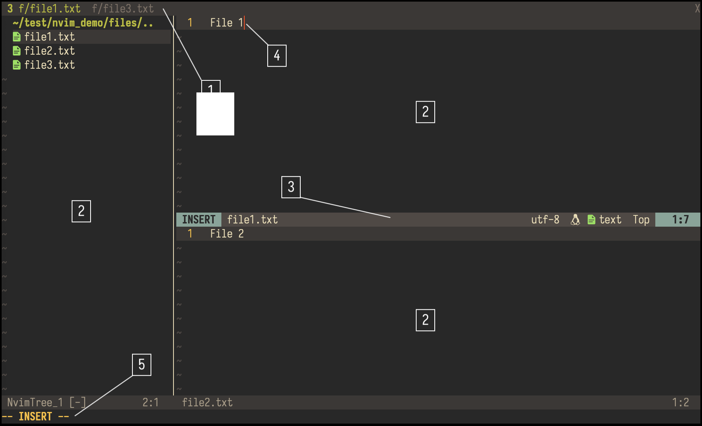
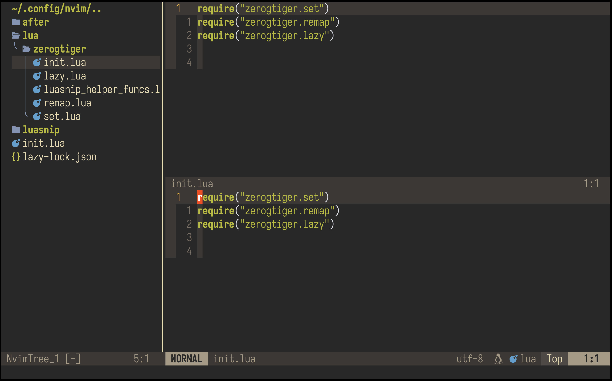
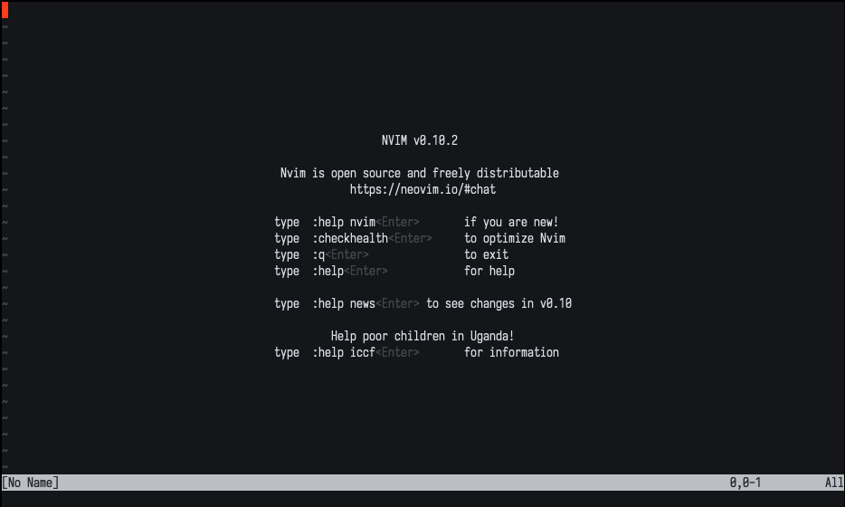

# Neovim Overview

## Goal Of This Article

This article is an overview of how Neovim works, its visual components, startup sequence, and how 
to use the `nvim` command in terminal

## How Neovim Works

Neovim is a terminal text editor program that displays a textural user interface (TUI) in the 
terminal. By interacting with Neovim, the user can open, edit, and save files to the computer.

Similar to how Neovim runs in a terminal window, Neovim plugins must run in a Neovim instance.
All user interactions will either be with the terminal, Neovim, or a Neovim plugin.
This relationship is illustrated in the diagram below.



While there are graphical ports of Neovim (ones that runs separately from a terminal, such as the 
[Neovim-QT](https://github.com/equalsraf/neovim-qt)), they are less versatile and offer much of the 
same functionality as the terminal counterpart. For this series, we'll focus on the Neovim terminal
executable.

## Visual Components



Above is a screenshot of a well configured Neovim editor to illustrate the different on-screen 
components. Correspond each number with the item below

1. **Tabline** can be thought of browser tabs, except instead of webpages, it displays a series of 
panes displaying buffers. 

2. **Pane/buffer**
    
    **Panes** are the components responsible for displaying a buffer, whereas a **buffer** is the
    actual contents (i.e., the text) stored in the computer's memory.

    Texts in buffers generally come from a file, but could originate from Neovim itself, commonly a 
    plugin. In the latter case, the texts generally act as a display of information, such as the 
    file structure in a directory.

    There are three panes in the above sample. The leftmost pane displays a file explorer with
    text in that buffer generated by a file explorer plugin. The user can interact with it in 
    specific ways to add, delete, and perform other operations with the file system.

3. **Statusline** refers to bar that at the lower part of each pane, displaying useful information of the pane. 

    The default, unconfigured statusline doesn't do much
    <!-- , it displays the file name,  -->
    <!-- cursor location, and mode. The mode isn't displayed in the above image since it's currently in  -->
    <!-- normal mode, which by default, will not be shown. -->
    <!-- The panes have also been configured to display the relative line number. -->
    However, in the above image, the statusline has been configured to display the
    - mode (`insert`),
    - file name (`file1.txt`),
    - file encoding (`utf-8`),
    - line ending style (UNIX, indicated by the penguin),
    - file type (`text`), and,
    - cursor location (`Top 1:7`)

    in that order. 

    The cursor location comprises of two parts: 
    - a percentage indication (or `Top`/`Bot` for first/last line), and
    - "line number":"column number"

    For instance, in the above image, the cursor is on the seventh character on the first line (`1:7`), at the top of the file (`Top`).

1. **Cursor** can be understood to be the cursor in a word processing program. It is the location 
where text will be inputted. 

    In Neovim, typing text might not always translate to text being inputted. Generally, the 
    location of the cursor indicates which pane/buffer you're commands will affect. 

<!-- - **Buffer** refers to the text stored in the computer's memory. -->

5. **Command line** is where the user typed commands will appear. Currently, since the editor is in 
`insert` mode, it is unused so Neovim displays the mode instead.
<!---->
<!---->
<!---->
<!---->
<!-- Here is a sample of a fully configured editor used to illustrate some other terms.  -->
<!--  -->
<!---->
<!-- **Panes** display buffers. There are three panes in the above sample,  -->
<!-- - The leftmost pane displays is a file explorer. The text in that buffer is generated by -->
<!-- a file explorer plugin and the user can interact with it in dedicated ways to add, delete, and  -->
<!-- perform other operations with the file system. -->
<!---->
<!-- - On the right are two panes split horizontally. They display the same file buffer.  -->
<!---->
<!---->
<!---->

## Command Line Usage of `nvim`

If you've successfully installed Neovim (see [Prerequisites](prereq) if not already), you should be
able to open terminal and type `nvim`, followed by the enter key.

This will open the Neovim editor on an empty, unnamed file with some messages in the center of the 
screen starting with the version followed by some command suggestions. Something like the following



To quit the editor, type `:q`, then press enter. 

Though cool, this isn't useful. We usually open an editor to edit files. To open a file, navigate to
the directory where the file is located in your terminal, then type `nvim <file name>`, followed by 
the enter key. You should see the file contents being displayed.

Similarly, to quit the editor, type `:q`, then press enter; if you're met with an error, try `:q!`, 
followed by the enter key. Specifics of the `:q` command will be explained in the commands section 
in the next article of this series. For now, know that it is the way to quit from the editor back 
to your terminal.

You may chain specify multiple files to open, such as `nvim file1.txt file2.txt file3.txt`. 
Without additional flags introduced below, you'll find only the first file is displayed while the 
others are opened as buffers hidden away.
<!-- We'll explore how to display these files in the next article.  -->

Aside from file name, you may also open files with certain options flags, a few key ones are listed below
- `-R`: read only mode. You may still edit the file, but may not save it.
- `--clean`: loads Neovim ignoring any configuration files. This may be useful in later sections of this series.
- `-o[N]`: opens the list of specified files in separate panes stacked horizontally, with at most `N` panes
- `-O[N]`: opens the list of specified files in separate panes stacked vertically, with at most `N` panes
- `-p[N]`: opens the list of specified files in tab pages, with at most `N` tabs
- `--`: indicates the end of options, notifying Neovim that all text that follow are file names. This is only useful if your file names look like option flags. 

For instance, the command
```bash
nvim -R --clean -o2 file1.txt file2.txt file3.txt
```
will open three files: `file1.txt`, `file2.txt`, and `file3.txt` in read only mode, ignoring any 
plugins, in two horizontal panes.

If you want to read more about starting arguments, see the [Neovim official documentation](https://neovim.io/doc/user/starting.html#_nvim-arguments).

## Startup Sequence

When you type a `nvim` command and press enter, Neovim will perform a series of tasks, such as 
understanding the flags and reading the files the user specified to open (if any). While most
details of the start up process is unnecessary to understand as a user, we should understand one of 
the important steps that occurs: reading the user configuration of the editor.

User configuration of Neovim need to be placed at a fixed location to be read and applied by the 
editor on startup. For UNIX systems, this file location is `~/.config/nvim/init.vim` or 
`~/.config/nvim/init.lua`. For Windows, this file location is `~/AppData/Local/nvim/init.vim` or 
`~/AppData/Local/nvim/init.vim`.

We'll get to writing configurations in later articles. For now, know that they're files that 
specify how the editor should look, behave, and what plugins to include. Also note it is read again 
every time the editor starts from a terminal command.

As a side note, Neovim startups are generally extremely fast. Neovim on my personal configuration 
(~2000 lines) starts consistently in less than 200 ms.


Next, we'll learn about navigating the editor with Vim keybindings. 

