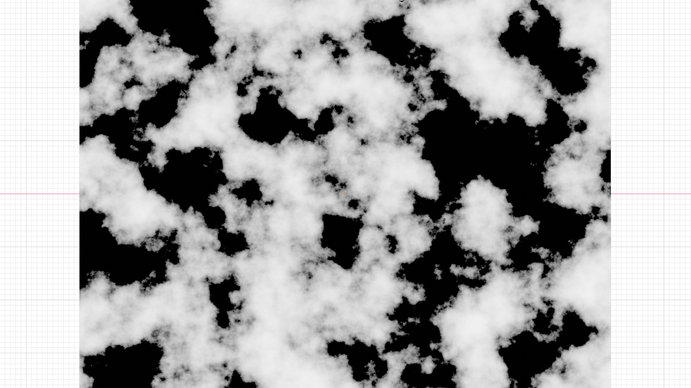

# Photorealistic Water Canyon Landscape
## Goal of this project: 

To create a non-destructive photorealistic water canyon landscape using procedural textures via object displacement. 

**What I'm talking about:** 
- Non-destructive (modelling): altering the apparent geometry of the mesh in algorithmic methods which does not change the *true* geometry (i.e. the position of the vertices of that model stays unchanged).
- Photorealistic: the rendering of a computer generated image with the impersonality of a photograph. 
- Procedural textures: a texture created using a mathematical description, thus resulting in unlimited texture resolution
- Displacement: a technique for adding geometric detail to object surfaces as they are rendered by *displacing* them in 3D space. 

## Final render

This project has been shared on [Blenderartists.org](https://blenderartists.org/t/water-canyon-landscape/1478219) and featured on [Blendernation](https://www.blendernation.com/2023/08/18/best-of-blender-artists-2023-33/#jp-carousel-169434). Go give it a like if you please!

**What you're seeing:** A computer generated image where the underlying geometry for both the water, canyon, and clouds are nothing more than just planes or cubes with four or eight vertices. All variations in geometry (water ripples, canyon variations, cloud details) were generated using displacement based on a procedural texture.

Technical Details

<ul>
<li>Render engine: Cycles X (via Blender 3.6.0)</li>
<li>Render time: 15 minutes</li>
<li>Denoising: a "mix" of the original noisey image and the Blender built-in denoised image with a factor of 0.618</li>
</ul>

## About this project

### Canyon
Blender's [musgrave texture](https://docs.blender.org/manual/en/latest/render/shader_nodes/textures/musgrave.html) was used to generate the canyon geometry. Here's part of the Musgrave texture responsible for the canyon displacement (brighter = more displacement)

The canyon texture was procedurally generated based on the Blender noise texture by increasing the z-scale to create a layered appearance, then using the result as a factor to control two raw color inputs (shown below). 

Combining the procedural displacement with the texturing, here's the final result as seen in the viewport. (The low-poly appearance is an effect of viewport optimization)

Note that a subdivision surface modifier was used with the adaptive subdivision option to subdivide the canyon plane based on the camera location. 

### Water

Despite being able to generate the wave displacement easily by tweaking the Musgrave texture, the water was the most difficult to recreate due to its surface roughness and transparency. As well, the splashing waves against the canyon base also required some clever use of node groups. 

The ambient occlusion node was really handy as it helped distinguish areas where geometries intersected. Thus, generating a mask based on its output, I was able to
- vary the scale of the Musgrave texture responsible for the wave appearance, creating greater concentration of rippling near the canyons
- control the smoothness of the water surface to be more rough near the canyon to generate a foamy effect
- adjust the transparency of the water to be less see-through near the canyon base, also to mimic a foamy effect
- change the color of the water surface near the shoreline

A close-up of the shoreline (as seen in the viewport) is shown here (as unrealistic as it looks, the details are hardly noticeable when taking an aerial shot). 

The only non-procedural part of this project was the trail left by the boat in the water, where Wave Dynamic Paint was used to create the parting waves. 

### Clouds & Fog

Clouds were generated with the 3D variation of the Musgrave texture. A volume scatting node with a few tweaks was used to create its appearance.

Volumetric fog was originally added, though removed in the final render as it was too taxing on the rendering time with little gain in visual value. 

### Lighting

The lighting was completely done with the use of a sunset HDRI texture found on Poly Haven. Some rotations, including a few degrees on the y-axis, were performed to allow the sunlight to shine over the canyons and directly onto the sail of the boat to create a focal point in the final render. 

## Remarks

This project was carried through as an exploration of the extent at which procedural textures could be used to create geometries that were the main subject of a render. Such a method of creating landscapes, distinct from the traditional mode of manual modelling, simplifies the generation of non-repetitive natural scenes. It does, however, present barriers for the artist when wanting precise control over the landscape layout.

If you are interested in the original project file or have questions, please don't hesitate to contact me.

 
Last updated August 29th, 2023
